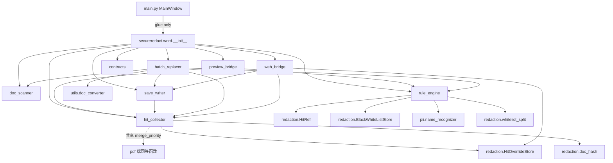

# Architecture Research — v39 Word 文档脱敏重构

**Domain:** SecureRedact Word 文档脱敏架构（main.py 散落 → `secureredact/word/*` 子包）
**Researched:** 2026-08-19
**Confidence:** HIGH（基于完整源码 + 162 项回归基线 + v37-v38 已落地的 `secureredact/redaction/` 公共包）

---

## 1. Executive Summary

v39 的核心问题是 **main.py 单体内聚度**——Word 文档脱敏的整条链路（扫描 / 命中 / 预览 / 替换 / 写出 / 干预消费）有超过 40 个函数、2 个 QThread、1 个 WebViewBridge、3 个 Dialog 散落在 `main.py` 的 13k 行里，仅 `WordWorker` 一个 QThread 被抽到了 `secureredact/workers/word_worker.py`（254 行）。其他一切（包括 `_save_word` / `merge_word_matches_with_priority` / `build_word_rule_matches` / `replace_matches_in_paragraph` / `_build_word_html_from_docx` / `_build_word_replaced_preview_html` / `WordBatchReplaceWorker` 等）都还在 `main.py` 中。

v39 架构目标是：

1. **抽取** Word 端所有业务逻辑到 `secureredact/word/*` 子包，main.py 仅留 UI 装配 + 信号连接（**ARCH-01**）
2. **分层契约** 规则 / 命中 / 预览三层走明确接口，调一处不破另一处（**ARCH-02**）
3. **复用边界文档化** 与 PDF 端共用部分（OCRWorker / HitOverrideStore / BlackWhiteListStore / whitelist_split / doc_hash）划清（**ARCH-03**）
4. **字段命名统一** `source / start / end / rect / text` 字段映射表（**ARCH-04**）

本文档不讨论 FP / FN / 测试（已有 REQUIREMENTS.md 的 FP-01~04 / FN-01~04 / TEST-01~03），只聚焦架构。

---

## 2. Current Architecture Audit

### 2.1 main.py 内 Word 相关代码定位

| 区段 | 行号 | 职责 |
|------|------|------|
| `normalize_word_replace_rules` | 251-289 | Word 多字段规则归一化（exact/regex） |
| `resolve_word_preview_image_suffix` | 292-309 | mammoth 图片后缀推导 |
| `_range_overlaps` | 312-317 | 区间重叠判定 |
| `build_word_rule_matches` | 320-360 | 规则扫描生成 matches（含 overlap 处理） |
| `apply_rule_matches_to_text` | 363-382 | 倒序替换避免索引偏移 |
| `apply_word_rules_to_text` | 385-388 | 上面的便利封装 |
| `build_replaced_preview_segments` | 391-439 | 右侧预览 segment 构造 |
| `build_highlight_preview_segments` | 442-478 | 左侧预览 highlight segment |
| `build_word_panel_update_script` | 484-501 | 增量 DOM 刷新 JS 模板 |
| `should_reload_word_panel` | 504-510 | 面板 reload 判定 |
| `merge_word_matches_with_priority` | 878-921 | `rule > manual > ocr` 合并 |
| `apply_range_to_runs` | 924-977 | run 级区间替换（核心算法） |
| `replace_matches_in_paragraph` | 980-1033 | 段落级 run 替换（cell 复用） |
| `WordReplaceRulesDialog` | 3242-3478 | Word 多字段规则编辑 UI |
| `WordBatchReplaceWorker` | 4087-4280 | 批量替换 QThread（含 `.doc`→`.docx` 转换） |
| `OCRWorker(_ModularOCRWorker)` | 4528-4540 | PDF OCR 兼容层（仅 main.py 的入口） |
| `WebViewBridge` | 4542-4762 | JS↔Python 桥（manual + HitOverride 4 槽） |
| `WordWorker(_ModularWordWorker)` | 4766-4773 | Word 扫描兼容层 |
| `_INTERACTIVE_JS_CODE` | 4777-5316 | mammoth 注入的 JS（约 540 行，含 contextmenu + data-key 定位） |
| MainWindow 内嵌 Word 状态 | 5362-5380 | `word_doc / word_data / word_replace_rules / _word_data_lock` |
| `_reset_word_preview_cache` 等 | 5555-5610 | 预览缓存失效 |
| `_build_word_html_from_docx` | 5612-5780 | mammoth DOCX→HTML + image handler |
| `_open_word_docx` | 11054-11112 | 打开 docx、构造 word_data dict |
| `_open_word_doc` | 11114-11156 | `.doc` 转换入口 |
| `_save_word` | 13051-13180 | 写出 docx（含 filtered_hits + replace_matches_in_paragraph） |
| `render_word_preview` | 11947-12026 | 预览编排（HTML 双栏 + 增量更新） |
| `_build_word_preview_documents` | 12028-12068 | 预览文档一次构建 |
| `_build_word_text_blocks` | 12243-12250 | 预览用 text_blocks 字典 |
| `_build_word_original_panel_updates` | 12251-12336 | 左 panel `<mark>` 生成 |
| `_build_word_replaced_panel_updates` | 12337-12365 | 右 panel `replace-preview-highlight` 生成 |
| `_add_data_key_attributes` | 12600-12830 | 给 mammoth HTML 打 `data-key` |
| `_build_word_replaced_preview_html` | 10651-10716 | 右 panel 完整 HTML 重建 |
| `_build_replaced_preview_fragment` | 10613-10649 | 右 panel 块级 fragment |

### 2.2 字段不一致盘点

| 位置 | 字段 | 类型 | 备注 |
|------|------|------|------|
| OCRWorker hit dict | `rect: QRectF`, `source: str`, `text: str`, `rule_name: str` | PDF 坐标 | `text` 故意保持空（v38.0.1 hotfix） |
| WordWorker match dict | `pattern: str`, `rule_name: str`, `start: int`, `end: int`, `text: str`, `replacement: str`, `source: str` | 字符索引 | `source ∈ {rule, jieba, blacklist}` |
| WebViewBridge manual | `start: int`, `end: int`, `text: str`, `replacement: str`, `mode: str` | 字符索引 | `mode ∈ {exact, global}`（无 source 字段） |
| `_locate_hit` PDF | `rect.x()/width()` | PDF 坐标 | 与 OCRWorker 一致 |
| HitRef | `start: int`, `end: int` | PDF 用 QRectF 离散化 / Word 用字符 | 兼容两种坐标（`_hit_to_ref` duck-type） |
| JS `<mark>` | `data-key`, `data-source`, `data-hit-id` | DOM 字符串 | `hit-id = f"{doc_hash}|{location}|{start}|{end}|{source}"` |
| `merge_word_matches_with_priority` 输出 | `start, end, text, replacement, source, mode, rule_name` | 字符索引 | `mode ∈ {rule, manual, ocr}`（与 manual 不同语义） |
| `_build_word_original_panel_updates` 输出 | 含 `source, rule_name, mode` | DOM | source ∈ {rule, ocr, jieba, manual, blacklist} |
| `_build_word_replaced_panel_updates` 输出 | 含 `source, mode, rule_name` | DOM | mode 来自 rule.exact/regex |

**冲突点（ARCH-04 必解）**：

1. **同一字段语义不同**：OCRWorker 用 `rect`，Word 用 `start/end`，HitRef duck-type 兼容两者但 `text` 含义不同（OCR hit.text 可能为空，Word hit.text 必有值）
2. **`mode` 字段多重含义**：manual 来源的 `mode ∈ {exact, global}`（用户操作语义）vs `merge_word_matches_with_priority` 输出的 `mode ∈ {rule, manual, ocr}`（来源语义）vs `replace_matches_in_paragraph` 的 `mode`（规则类型）
3. **`replacement` 字段来源**：OCRWorker 不携带（依赖全局 `replacement_text`）；WordWorker 携带（每个 match 一个 `replacement`）
4. **rule_name 来源**：OCRWorker hit 中固定为 pattern 字符串 / "OCR图像通道" / "印章检测"；WordWorker 通过 `default_rules` 反查规则名

### 2.3 跨边界耦合清单

| 模块 | 被耦合方式 | 影响 |
|------|-----------|------|
| `merge_word_matches_with_priority` | main.py 唯一实现，预览 + 保存共用 | 调一处必破另一处 |
| `replace_matches_in_paragraph` / `apply_range_to_runs` | main.py 内联，`_save_word` + `WordBatchReplaceWorker` + cell 内复用 | 任何 run 替换 bug 必破坏三处 |
| `WebViewBridge` | 直接读写 `self.main_window.word_data` | JS 桥与 main_window 强耦合 |
| `_save_word` | 读取 `self.word_replace_rules / self.replacement_text / self._override_store / self._current_doc_hash` | 单体依赖 |
| `_build_word_replaced_preview_html` | 用 BeautifulSoup 解析 mammoth HTML | BeautifulSoup + mammoth 跨进程依赖 |
| `_build_word_html_from_docx` | mammoth + 临时目录 + 自定义 image handler | 资源管理跨边界 |

---

## 3. Recommended Architecture

### 3.1 总览：`secureredact/word/*` 子包

```
secureredact/word/
├── __init__.py                  # 公共 API（延迟导入）
├── contracts.py                 # 数据契约（HitDict / PreviewSegment / WordDocSnapshot）
├── doc_scanner.py               # DOCX 文档结构读取（paragraph/table/header/footer/comment/footnote/endnote）
├── rule_engine.py               # 规则 + jieba + blacklist 注入 + whitelist 过滤 → hits
├── hit_collector.py             # 多通道命中聚合（rule / ocr / manual / jieba / blacklist / seal）+ 优先级合并
├── preview_bridge.py            # DOCX → mammoth HTML + data-key 注入 + 左/右 panel fragment 生成
├── batch_replacer.py            # WordBatchReplaceWorker（重构自 main.py）
├── save_writer.py               # 把 merged hits 写回 docx 的 run 级替换逻辑（apply_range_to_runs / replace_matches_in_paragraph）
├── web_bridge.py                # WebViewBridge（替换 main.py 内类）
└── fixtures.py                  # 真实样本 fixture loader（抵账协议0522.docx----刘骁毅原版.docx）
```

**保留在 `secureredact/` 公共层（不挪进 `word/`）**：

- `secureredact/redaction/` 全部（`HitRef / Override / HitOverrideStore / BlackWhiteListStore / whitelist_split / doc_hash`）
- `secureredact/ocr/` PDF 端共享逻辑（与 Word 不共用，但同名 `OCRWorker` 仍属 PDF）
- `secureredact/pii/name_recognizer.py` 中文姓名识别（PDF + Word 共用）
- `secureredact/utils/` doc_converter / temp_manager / security / exceptions

### 3.2 模块契约表

| 模块 | 输入 | 输出 | 依赖 | 不依赖 |
|------|------|------|------|--------|
| `contracts.py` | — | `HitDict` TypedDict / `PreviewSegment` TypedDict / `WordDocSnapshot` dataclass / `HitSource` Literal | — | — |
| `doc_scanner.py` | `Document(file_path)` 或文件路径 | `WordDocSnapshot`（paragraphs / tables / headers / footers / comments / footnotes / endnotes，每个 item 含 key + text + 源对象引用） | `python-docx` | 规则 / 预览 / 替换 |
| `rule_engine.py` | `text: str`, `rules: list`, `custom_keywords: list`, `replacement: str`, `enable_name_recognition: bool` | `list[HitDict]`（含 source / start / end / text / rule_name / replacement） | `BlackWhiteListStore` / `pii.name_recognizer` / `redaction.whitelist_split` | `doc_scanner` / `preview_bridge` / `save_writer` |
| `hit_collector.py` | `WordDocSnapshot`, `list[HitDict]`（来自 rule_engine + ocr_worker + 人工 WebViewBridge）, `doc_hash`, `location` | `list[HitDict]`（merged，按 `rule > manual > ocr` 排序 + HitOverrideStore 过滤） | `HitOverrideStore` / 共享 `merge_priority()` 函数（也供 PDF 端复用） | mammoth / python-docx |
| `preview_bridge.py` | `WordDocSnapshot` + `dict[key, list[HitDict]]` (merged) | `(original_html, replaced_html, panel_updates: dict[key, str])` | `mammoth` / `BeautifulSoup` / `rules_engine.build_highlight_segments` / `rules_engine.build_replaced_segments` | QObject / PyQt 信号 |
| `batch_replacer.py` | `list[file_path]`, `list[WordReplaceRule]`, `default_replacement_text` | QThread 信号（progress / file_done / file_error / finished） | `doc_converter` / `save_writer` / `rules_engine` | 预览 |
| `save_writer.py` | `Document(file_path)`, `dict[key, list[HitDict]]`, `replacement_text` | 修改后的 `Document`（in-place，不落盘） | python-docx / `hit_collector.merge_priority` | mammoth / 预览 |
| `web_bridge.py` | QObject + main_window 引用 | `@pyqtSlot` 暴露给 JS：`add_manual_redaction / remove_manual_redaction / handle_ocr_hit_contextmenu / report_word_preview_scroll` | `WebViewBridge`（重构自 main.py；调用 `redaction.HitOverrideStore` + `hit_collector.merge_priority`） | mammoth / python-docx |

### 3.3 模块间依赖图



### 3.4 跨 PDF/Word 共用模块

| 模块 | Word 用 | PDF 用 | 共用接口 |
|------|---------|--------|----------|
| `redaction/HitRef` / `Override` | ✓ | ✓ | `HitRef` 数据类 + `VALID_SOURCES` |
| `redaction/HitOverrideStore` | ✓ | ✓ | `instance().filtered_hits(hits, location, doc_hash)` 唯一消费入口 |
| `redaction/BlackWhiteListStore` | ✓（间接通过 rule_engine） | ✓（OCRWorker） | `effective_whitelist() / effective_blacklist() / is_trim_only()` |
| `redaction/whitelist_split._split_text_by_whitelist` | ✓（rule_engine） | ✓（OCRWorker） | `[(start, end, span), ...]` 纯函数 |
| `redaction/doc_hash.compute_doc_hash` | ✓（save / batch） | ✓（canvas） | sha1(path + size + mtime_ns)[:8] |
| `pii/name_recognizer.extract_person_names` | ✓（rule_engine） | ✓（OCRWorker） | `list[str]` |
| `ocr/OCRWorker`（独立 PDF 通道） | ✗（不共用 OCR，但若 Word 嵌入图走 OCR 通道，**复用同一 RapidOCREngine**） | ✓ | 通过 `RapidOCREngine.recognize(img)` 调用，**OCRWorker 自身仍属 PDF 通道** |
| `utils/doc_converter` | ✓（`.doc`→`.docx`） | ✗ | `_shared_convert_doc_to_docx` |
| `utils/temp_manager` | ✓（`_save_word`） | ✓（PDF save） | `create_temp_file` |

**未共用的（明确 PDF-only）**：

- `ocr/text_pdf.collect_text_pdf_hit_boxes` — PDF 文本通道专用
- `ocr/mixed_pdf.collect_image_block_ocr_hits` — PDF 嵌入图专用
- `ocr/mixed_pdf.merge_adjacent_hit_rects` — PDF rect 合并专用

---

## 4. Data Flow

### 4.1 Word 文档脱敏端到端流

```
[打开 .docx]
    │
    ▼
doc_scanner.scan(file_path) ─► WordDocSnapshot
    │                              ├─ paragraphs: [(key, text, para_obj), ...]
    │                              ├─ tables: [(key, text, cell_obj, cell_paras), ...]
    │                              ├─ headers/footers: [(key, text), ...]
    │                              └─ comments/footnotes/endnotes: [(key, text), ...]
    │
    ▼
[WebViewBridge] mammoth + data-key 注入 ─► base_html（仅首次）
    │
    ▼
[扫描入口 MainWindow.start_scan]
    │
    ▼
rule_engine.scan(snapshot, rules, custom_keywords, replacement, enable_name_recognition)
    │   对每个 (key, text):
    │     - regex finditer → rule_hits[source='rule']
    │     - jieba extract_person_names → jieba_hits[source='jieba']
    │     - BlackWhiteListStore.effective_blacklist → blacklist_hits[source='blacklist']
    │     - whitelist 过滤（trim_only=True 切片段，否则整条剥掉）
    │
    ▼
hit_collector.aggregate(snapshot, raw_hits_by_key)
    │   每个 key: raw_hits = ocr_hits + manual_hits + rule_hits + jieba_hits + blacklist_hits
    │   1. HitOverrideStore.filtered_hits(raw_hits, location=key, doc_hash=...)
    │   2. merge_priority(filtered, source_order=('rule', 'manual', 'ocr', 'jieba', 'blacklist'))
    │
    ▼
preview_bridge.build_panels(snapshot, merged_hits_by_key)
    │   左 panel: original_html + data-key + mark.ocr-highlight / mark.manual-highlight
    │   右 panel: replaced_html + mark.replace-preview-highlight
    │   增量: panel_updates[key] = fragment_html（仅增量块）
    │
    ▼
[MainWindow.render_word_preview] setHtml + 增量 JS
    │
    ▼
[用户交互] JS pyBridge.add_manual_redaction / ignore_ocr_hit / confirm_ocr_hit
    │
    ▼
web_bridge.slot_add_manual_redaction(key, start, end, text)
    │   → word_data[key]['manual'].append(HitDict)
    │   → main_window.render_word_preview() 触发重渲染
    │
    ▼
[保存入口 MainWindow.save_word]
    │
    ▼
save_writer.apply_redactions(doc, merged_hits_by_key, replacement_text)
    │   对每个 key 的 merged_hits:
    │     - apply_range_to_runs(para, start, end, replacement)
    │     - replace_matches_in_paragraph(para, hits, text_offset=0)
    │
    ▼
doc.save(output_path)
```

### 4.2 批量替换流（WordBatchReplaceWorker）

```
[启动] main_window.start_batch_replace(file_paths)
    │
    ▼
batch_replacer.BatchReplacer(file_paths, rules, replacement)
    │   对每个 file:
    │     1. doc_scanner.scan(file_path) ─► WordDocSnapshot
    │     2. rule_engine.scan(snapshot, rules, keywords, replacement, enable_name)
    │     3. hit_collector.aggregate(snapshot, raw_hits, source_order=('rule',))  # 批量只走 rule
    │     4. save_writer.apply_redactions(doc, merged_hits)
    │     5. doc.save(output_path)
    │     6. emit file_done_signal / file_error_signal
    │
    ▼
finished_signal ─► summary
```

### 4.3 人工干预流（HitOverride 4 槽）

```
[JS contextmenu] handle_ocr_hit_contextmenu(key, source, text, hit_id, x, y)
    │
    ▼
web_bridge.slot_handle_ocr_hit_contextmenu(...)
    │   QMenu: ignore / confirm / promote / revert / cancel
    │
    ▼
HitOverrideStore.instance().ignore(ref) / confirm(ref) / promote(hit_id) / revert(hit_id)
    │
    ▼
save_permanent() ─► config.json["redaction.overrides.permanent"]
    │
    ▼
render_word_preview() ─► HitOverrideStore.filtered_hits 重新过滤
```

### 4.4 字段契约表（统一后）

| 字段 | 类型 | 必填 | 含义 | 来源枚举 |
|------|------|------|------|----------|
| `start` | `int` | ✓ | 字符索引（Word）或 PDF 坐标 x（HitRef 兼容） | — |
| `end` | `int` | ✓ | 同上 | — |
| `text` | `str` | ✓ | 命中原文（OCR 通道允许空） | — |
| `source` | `Literal["rule","ocr","jieba","seal","blacklist","manual"]` | ✓ | 命中来源 | 与 `VALID_SOURCES` 对齐 |
| `rule_name` | `str` | 可选 | 触发命中的规则名（OCRWorker 固定为 "OCR图像通道"/"印章检测"） | — |
| `replacement` | `str` | 可选 | 替换文本（OCRWorker 默认空，运行时由全局 `replacement_text` 兜底） | — |
| `pattern` | `str` | 可选 | 触发的 regex 模式（WordWorker 用，OCRWorker 用 rule_name） | — |
| `mode` | `Literal["exact","global","regex"]` | 可选 | 用户操作语义（仅 manual 来源用）；规则匹配模式（仅 word_replace_rules 用） | — |
| `rect` | `QRectF` | 仅 OCR | PDF 坐标系矩形 | — |
| `doc_hash` | `str` (8 hex) | 命中消费端 | 与 `HitRef.doc_hash` 一致 | `doc_hash.compute_doc_hash` |
| `location` | `str` | 命中消费端 | `f"paragraph_{idx}"` / `f"table_{T}_cell_{r}_{c}"` / `f"header_{N}_{idx}"` 等 | — |

**位置约定**（统一 `location` 格式）：

- `paragraph_{idx}` — Word 正文段落
- `table_{T}_cell_{R}_{C}` — Word 表格单元格
- `header_{S}_{idx}` — 页眉（S ∈ {default, first, even}, idx 为 paragraph idx）
- `footer_{S}_{idx}` — 页脚
- `comment_{idx}` — 批注
- `footnote_{idx}` — 脚注
- `endnote_{idx}` — 尾注
- `image_block_{idx}` — 嵌入图（FN-02 OCR 通道命中）

---

## 5. Interface Contracts

### 5.1 contracts.py（公共 TypedDict / dataclass）

```python
# secureredact/word/contracts.py
from __future__ import annotations
from dataclasses import dataclass, field
from typing import Any, List, Literal, Optional, TypedDict, Union
from PyQt6.QtCore import QRectF

HitSource = Literal["rule", "ocr", "jieba", "seal", "blacklist", "manual"]
Location = str  # 见上节"位置约定"
DocHash = str  # 8 hex


class HitDict(TypedDict, total=False):
    """统一的命中字典 — PDF / Word 端共用.

    字段命名规范 (ARCH-04):
    - 字符索引定位: start / end (Word 端默认)
    - PDF 坐标定位: rect (QRectF, OCRWorker 默认)
    - HitRef 构造 duck-type 自动兼容二者 (见 hit_ref._hit_to_ref)
    """
    start: int                # 必填 — 字符索引 (Word) 或 rect.x() 离散化 (PDF)
    end: int                  # 必填 — 同上
    text: str                 # 必填 — OCR 通道允许空字符串
    source: HitSource         # 必填 — VALID_SOURCES
    rule_name: str            # 可选 — 规则名 / 通道标签
    replacement: str          # 可选 — 替换文本
    pattern: str              # 可选 — 触发 regex (WordWorker)
    rect: QRectF              # 可选 — PDF 坐标 (OCRWorker); Word 端不填
    mode: str                 # 可选 — 用户操作语义 / 规则模式


class PreviewSegment(TypedDict, total=False):
    """预览片段."""
    value: str
    type: Literal["text", "highlight", "replacement"]
    source: HitSource
    mode: str
    rule_name: str
    start: int                # 仅 highlight 用
    end: int                  # 仅 highlight 用


@dataclass(frozen=True)
class WordLocation:
    """Word 文档位置标识 — 替代字符串 location.

    v39 引入类型化封装, 内部仍兼容字符串 location 用于 HitRef 兼容.
    """
    kind: Literal["paragraph", "table_cell", "header", "footer",
                  "comment", "footnote", "endnote", "image_block"]
    index: int                # paragraph_idx / table_idx / etc.
    sub_index: int = 0        # row, col, or paragraph_in_cell

    def to_str(self) -> Location:
        if self.kind == "table_cell":
            return f"table_{self.index}_cell_{self.sub_index // 1000}_{self.sub_index % 1000}"
        return f"{self.kind}_{self.index}"


@dataclass
class WordDocSnapshot:
    """Word 文档快照 (扫描中间态, 不可变).
    
    v39 用 snapshot 替代 main.py 的 word_data dict[key]['text'] 模式.
    snapshot 同时携带源 paragraph / cell 对象引用, 用于 save_writer 写回.
    """
    file_path: str
    doc_hash: DocHash
    paragraphs: List["ParagraphEntry"] = field(default_factory=list)
    tables: List["TableEntry"] = field(default_factory=list)
    headers: List["HeaderEntry"] = field(default_factory=list)
    footers: List["FooterEntry"] = field(default_factory=list)
    comments: List["CommentEntry"] = field(default_factory=list)
    footnotes: List["FootnoteEntry"] = field(default_factory=list)
    endnotes: List["EndnoteEntry"] = field(default_factory=list)
    image_blocks: List["ImageBlockEntry"] = field(default_factory=list)


@dataclass
class ParagraphEntry:
    key: str                  # "paragraph_{idx}"
    location: WordLocation
    text: str
    runs: list                # python-docx run 列表 — save_writer 用
    para_obj: Any             # python-docx Paragraph 对象


@dataclass
class TableEntry:
    key: str                  # "table_{T}_row_{R}_cell_{C}"
    location: WordLocation
    text: str
    cell_paras: list          # [ParagraphEntry, ...] — cell 内段落
    cell_obj: Any             # python-docx _Cell


# ... HeaderEntry / FooterEntry / CommentEntry / FootnoteEntry / EndnoteEntry / ImageBlockEntry 类同
```

### 5.2 rule_engine.scan() 契约

```python
# secureredact/word/rule_engine.py
def scan(
    text: str,
    *,
    rules: List[str],
    custom_keywords: List[str] | str = "",
    replacement: str = "[已脱敏]",
    enable_name_recognition: bool = False,
    key: str = "",
    whitelist_trim_only: Optional[bool] = None,  # None = 读 BlackWhiteListStore
) -> List[HitDict]:
    """扫描 text 返回命中列表 (未经过 HitOverrideStore 过滤).

    字段保证:
      - start / end: Python str 索引 (左闭右开)
      - text: 命中的原文 (jieba / blacklist 路径必填)
      - source: "rule" | "jieba" | "blacklist"
      - rule_name: 反查 default_rules (rule 路径) 或 "姓名启发式" (jieba) 或 "黑名单:{item}" (blacklist)
      - replacement: 与入参 replacement 一致 (统一在合并层处理 per-rule replacement)

    白名单行为:
      - whitelist_trim_only=True: 只剥白名单片段, 保留非 wl 子串
      - whitelist_trim_only=False: 整条剥掉 (v37.9.0 行为)
      - whitelist 为空: 跳过过滤
    """
```

### 5.3 hit_collector.aggregate() 契约

```python
# secureredact/word/hit_collector.py
def aggregate(
    raw_hits_by_key: Dict[str, List[HitDict]],
    *,
    doc_hash: DocHash,
    source_priority: Tuple[HitSource, ...] = ("rule", "manual", "ocr"),
) -> Dict[str, List[HitDict]]:
    """多通道命中聚合 (rule / manual / ocr / jieba / blacklist) + HitOverride 过滤.

    流程 (每个 key):
      1. raw = raw_hits_by_key[key] (ocr + manual + rule + jieba + blacklist 全并入)
      2. filtered = HitOverrideStore.instance().filtered_hits(raw, location=key, doc_hash=...)
         (manual 永远保留; ignored OCR/jieba/blacklist 剥掉; confirm 保留)
      3. merged = merge_priority(filtered, source_priority) — 先到先得 + 重叠判定
      4. merged.sort(key=lambda h: h["start"])

    返回 dict[key] = merged_hits (供 preview_bridge + save_writer 共用)
    """


def merge_priority(
    hits: List[HitDict],
    priority: Tuple[HitSource, ...],
) -> List[HitDict]:
    """按 source 优先级合并 + 重叠区间先到先得.

    内部 _range_overlaps 判定: 跨源重叠时, 高优先级赢.
    """
```

### 5.4 preview_bridge 契约

```python
# secureredact/word/preview_bridge.py
def build_base_html(snapshot: WordDocSnapshot, asset_dir: Path) -> str:
    """DOCX → mammoth HTML + data-key 注入 + 交互 JS 注入.
    
    仅在 source_changed 时调用一次, 缓存到 MainWindow._word_base_html.
    """


def build_left_panel_updates(
    snapshot: WordDocSnapshot,
    merged_hits_by_key: Dict[str, List[HitDict]],
) -> Dict[str, str]:
    """左 panel 块级 fragment: mark.ocr-highlight / mark.manual-highlight.
    
    返回 {key: fragment_html} 供 setHtml 增量更新.
    """


def build_right_panel_updates(
    snapshot: WordDocSnapshot,
    merged_hits_by_key: Dict[str, List[HitDict]],
) -> Dict[str, str]:
    """右 panel 块级 fragment: mark.replace-preview-highlight.
    
    返回 {key: fragment_html} 供 setHtml 增量更新.
    """


def build_replaced_document_html(
    base_html: str,
    snapshot: WordDocSnapshot,
    merged_hits_by_key: Dict[str, List[HitDict]],
) -> str:
    """完整重建右 panel 文档 (首次加载用)."""
```

### 5.5 save_writer.apply_redactions() 契约

```python
# secureredact/word/save_writer.py
def apply_redactions(
    doc: Document,
    snapshot: WordDocSnapshot,
    merged_hits_by_key: Dict[str, List[HitDict]],
    *,
    replacement_text: str,
) -> None:
    """把 merged_hits 写回 doc (in-place, 不落盘).
    
    对每个 key 调用 _apply_to_paragraph(snapshot[key], hits) 或 _apply_to_cell(...).
    复用 _apply_range_to_runs (从 main.py 924 行提取).
    失败模式: KeyError / cell 偏移越界 → 跳过该 hit, 不抛.
    """
```

### 5.6 web_bridge 契约

```python
# secureredact/word/web_bridge.py
class WebViewBridge(QObject):
    """JS ↔ Python 桥 (Word 端).
    
    Slots (来自 main.py WebViewBridge):
      - add_manual_redaction(key, start, end, selected_text)
      - add_manual_redaction_global(key, selected_text)
      - remove_manual_redaction(key, start, end)
      - ignore_ocr_hit(key, source, text, hit_id)
      - confirm_ocr_hit(key, source, text, hit_id)
      - promote_override(hit_id)
      - revert_override(hit_id)
      - handle_ocr_hit_contextmenu(key, source, text, hit_id, x, y)
      - report_word_preview_scroll(panel_id, ratio)
    
    依赖 (注入式):
      - override_store: HitOverrideStore
      - doc_hash_getter: Callable[[], DocHash]
      - on_change: Callable[[], None]  # 触发 render_word_preview
    """
```

### 5.7 batch_replacer.BatchReplacer 契约

```python
# secureredact/word/batch_replacer.py
class BatchReplacer(QThread):
    """Word 批量替换线程 (从 main.py WordBatchReplaceWorker 重构).
    
    依赖:
      - doc_converter (utils) — .doc → .docx
      - rule_engine + hit_collector — 复用主路径
      - save_writer — 复用主路径
    
    Signals (保持兼容):
      - progress_signal(processed: int, total: int, current_file: str)
      - file_done_signal(input_path: str, output_path: str)
      - file_error_signal(index: int, input_path: str, error_msg: str)
      - finished_signal(summary: dict)
    """
```

---

## 6. Build Order（依赖图 → Phase 推进顺序）

### 6.1 依赖图

```
contracts.py        (Phase 1 — 无依赖)
   ↓
doc_scanner.py      (Phase 1 — 依赖 contracts)
   ↓
rule_engine.py      (Phase 1 — 依赖 contracts + redaction/BlackWhiteListStore + pii/name_recognizer)
   ↓
hit_collector.py    (Phase 2 — 依赖 contracts + redaction/HitOverrideStore)
   ↓
save_writer.py      (Phase 2 — 依赖 hit_collector)
   ↓
preview_bridge.py   (Phase 3 — 依赖 rule_engine + hit_collector)
   ↓
web_bridge.py       (Phase 3 — 依赖 hit_collector + redaction/HitOverrideStore)
   ↓
batch_replacer.py   (Phase 4 — 依赖 doc_scanner + rule_engine + hit_collector + save_writer)
   ↓
main.py 集成        (Phase 4 — 替换所有内联实现为新模块)
```

### 6.2 Phase 划分建议（与 ARCH-01 ~ ARCH-04 对齐）

| Phase | 内容 | ARCH 编号 | 验收 |
|-------|------|-----------|------|
| **Phase 1: contracts + doc_scanner + rule_engine** | 三个最底层模块抽出 + main.py 兼容层接入（`_open_word_docx` 调用 `doc_scanner.scan`，`_save_word` 调用 `rule_engine.scan`） | ARCH-01 部分 | `tests/unit/test_word_source_field.py` + 新增 `tests/unit/test_doc_scanner.py` 全 PASS |
| **Phase 2: hit_collector + save_writer** | 把 `merge_word_matches_with_priority` + `replace_matches_in_paragraph` + `apply_range_to_runs` 抽出 + `_save_word` 走 `save_writer.apply_redactions` | ARCH-01 + ARCH-04 | 现有 162 项回归不退化 + 新增 `tests/unit/test_hit_collector.py` + `tests/unit/test_save_writer.py` |
| **Phase 3: preview_bridge + web_bridge** | mammoth → HTML + data-key + 左/右 panel fragment 抽出 + WebViewBridge 抽出 + JS `data-*` 契约 | ARCH-01 + ARCH-02 | 现有回归 + `tests/unit/test_preview_bridge.py` + `tests/unit/test_web_bridge.py` + `test_bridge_override_slots.py` 不退 |
| **Phase 4: batch_replacer + 字段映射表 + main.py 胶水化** | `WordBatchReplaceWorker` 抽出 + ARCH-04 字段映射文档落 `docs/word/FIELD_MAPPING.md` + main.py 仅留 UI 装配 | ARCH-01 + ARCH-02 + ARCH-03 + ARCH-04 | `test_batch_word_replace.py` + 全部回归 + `wc -l main.py` 显著下降 |

### 6.3 每个 Phase 的前置依赖与并行可能性

| Phase | 前置依赖 | 可与哪个 Phase 并行 | 风险点 |
|-------|----------|--------------------|--------|
| 1 | `redaction/hit_ref.py` / `pii/name_recognizer.py` | 与 PDF 端修复（OCR/混合 PDF）独立 | doc_scanner 对 python-docx `header/footer/comment/footnote` API 兼容性 |
| 2 | Phase 1 + `redaction/override_store.py` | 与 FP-01~04 修复并行 | `replace_matches_in_paragraph` 在 cell 内段落偏移处理已有 bug 隐患 |
| 3 | Phase 2 + mammoth | 与 FN-01（结构全覆盖）部分并行 | BeautifulSoup 与 mammoth HTML 输出稳定性 |
| 4 | Phase 3 + 批量回归基线 | 与 TEST-02（fixture 集）并行 | main.py 集成时引用图复杂度（13k 行 → 期望降至 ~9k） |

### 6.4 风险与缓解

| 风险 | 缓解 |
|------|------|
| `replace_matches_in_paragraph` 在 cell 多段落场景下 text_offset 计算有历史 bug | Phase 2 用真实样本 fixture（含嵌套表格）加 5+ 单测覆盖 |
| mammoth 输出 HTML 在不同 Word 版本下结构差异（`.docx` 由 WPS / Microsoft Word 产出） | Phase 1 doc_scanner 增加 mammoth 后置校验（每个 paragraph 都要找到对应 text block） |
| `WordDocSnapshot` 持有 paragraph / cell 对象引用，与 python-docx 弱引用模型冲突 | 验证 snapshot 生命周期：持有 doc 对象引用 = 不 GC；批量替换结束后显式 doc.close() |
| WebViewBridge 移出 main.py 后，main_window 注入循环依赖 | Phase 3 用 `set_main_window(mw)` 后置注入（参考 PDF 端 `OCRWorker.set_main_window` 已落地的模式） |
| `HitRef` duck-type 兼容 `rect` / `start` 双坐标源，未来 LLM 接入可能引入新坐标类型 | contracts.py 引入 `HitDict` TypedDict 作为唯一字段契约，`HitRef._hit_to_ref` 内部分支下沉到 contracts |
| ARCH-04 字段映射表与 PDF 端命名同步 | 落 `docs/word/FIELD_MAPPING.md` 同时记录 PDF 端对应字段，REQ 评审时 PDF/Word 双签 |

---

## 7. Anti-Patterns to Avoid

### 7.1 main.py 散落（当前病灶）

**症状**：13k 行单文件，Word 扫描 / 命中 / 预览 / 替换 / 干预 5 条链路跨函数互相调用。
**不要做**：

1. **继续在 main.py 加新功能** —— 把任何 Word 相关新代码直接塞进 main.py（v37-v38 已数次发生）
2. **main.py 内重复实现 `merge_word_matches_with_priority`** —— 任何新页面 / 新对话框都要复用 `secureredact/word/hit_collector.merge_priority`，禁止 inline
3. **`WebViewBridge` 留在 main.py 内** —— 必须挪到 `secureredact/word/web_bridge.py`，否则 PyQt 信号绑定到 main_window 强耦合无法测试

### 7.2 字段漂移

**症状**：OCRWorker hit 用 `rect`，WordWorker hit 用 `start/end`，manual hit 无 `source` 字段，preview JS 用 `mode` 但语义多重（用户操作 vs 来源）。
**不要做**：

1. **新建 hit dict 时跳过 `source` 字段** —— `manual` 来源必须显式 `source="manual"`，否则 `HitOverrideStore.filtered_hits` 把 manual 剥掉（v37.8.0 bug 复现）
2. **新增 `mode` 字段时复用既有命名** —— 必须先在 `docs/word/FIELD_MAPPING.md` 登记再使用；既有冲突的 `mode` 字段重命名为 `user_op_mode` (manual) + `rule_mode` (规则) + `source_mode` (来源)
3. **在 hit dict 内嵌入 QRectF 又嵌入 start/end** —— 二选一：Word 端只用 `start/end`，PDF 端只用 `rect`，HitRef duck-type 兼容；禁止同一 hit 同时携带两者（造成坐标源不一致 bug）

### 7.3 预览-保存不同步

**症状**：preview_bridge 生成的 `mark.replace-preview-highlight` 与 save_writer 实际写入位置不同（run 切分误差）。
**不要做**：

1. **preview_bridge 与 save_writer 各自重新计算字符索引** —— 两者必须共用 `hit_collector.merge_priority` 的输出，且 `merged_hits_by_key` 是同一份数据
2. **preview fragment 中替换文本与 save_writer 替换文本不一致** —— 统一从 `replacement_text` 全局配置读取，禁止 fragment 内硬编码 `[已脱敏]`

### 7.4 doc_converter 边界

**症状**：`.doc`→`.docx` 转换走 LibreOffice / antiword，温度目录管理散落。
**不要做**：

1. **批量替换 + 单文档打开各自实现 `.doc` 转换** —— 必须复用 `secureredact/utils/doc_converter.py` 的 `_shared_convert_doc_to_docx`，临时目录由 `TempFileManager` 统一管理
2. **在 `secureredact/word/` 内重新实现 DOCX→PDF 或 DOCX→图像** —— 这超出 v39 范围；任何 OCR 通道复用走 PDF 端 `OCRWorker`，不在 Word 子包内置

---

## 8. PDF/Word 并行路径对照

| 维度 | PDF 端 | Word 端 | 共享 |
|------|--------|---------|------|
| 文档打开 | `fitz.open(path)` | `Document(path)` | 都走 `doc_hash.compute_doc_hash` |
| 扫描入口 | `OCRWorker.run` (QThread) | `WordWorker.run` (QThread) | 各自 QThread，互不依赖 |
| 文本通道 | `ocr/text_pdf.collect_text_pdf_hit_boxes` | `word/rule_engine.scan` | 不共用，但 `merge_priority` 共用 |
| 图像通道 | `ocr/mixed_pdf.collect_image_block_ocr_hits` | （v39 不引入；FN-02 预留） | 复用 `RapidOCREngine` |
| 命中坐标 | PDF: `rect: QRectF` / Word: `start/end` | — | `HitRef` duck-type |
| 合并优先级 | `rule > manual > ocr` (隐式) | `rule > manual > ocr` (显式 `merge_priority`) | **统一为 `hit_collector.merge_priority`** |
| 干预消费 | `_save_pdf` 走 `filtered_hits` | `_save_word` 走 `filtered_hits` | 共用 `HitOverrideStore.filtered_hits` 入口 |
| 写出 | `page.apply_redactions` | `run.text = prefix + replacement + suffix` | 完全不同（PDF 用 redact annotation，Word 用 run 重写） |
| 预览 | `_render_pdf_page`（QPixmap） | `_build_word_html_from_docx`（mammoth → HTML） | 完全不同（PDF 用 canvas，Word 用 WebView） |
| 批量 | 无（单文件） | `WordBatchReplaceWorker` | Word-only |
| 黑/白名单 | `BlackWhiteListStore` 复用 | `BlackWhiteListStore` 复用 | **完全共享** |
| 字段命名 | `rect / source / text / rule_name` | `start / end / source / text / rule_name` | **统一为 `HitDict` TypedDict** |

**架构原则**：

- **共享层**：`secureredact/redaction/` + `secureredact/pii/name_recognizer.py` + `secureredact/utils/temp_manager.py` + `secureredact/utils/doc_converter.py`
- **PDF 端独占**：`secureredact/ocr/*` + `secureredact/workers/ocr_worker.py` + `OCRCanvas` 相关
- **Word 端独占**：`secureredact/word/*`（v39 引入）+ `secureredact/workers/word_worker.py`（v36.5 抽出的 thin layer，可进一步合并进 `word/`）
- **互不交叉**：PDF 端不引入 mammoth / python-docx；Word 端不引入 fitz / RapidOCR（FN-02 嵌入图 OCR 通道走 `OCRWorker` 复用，不在 Word 子包内置 OCR）

---

## 9. Migration Plan（main.py → secureredact/word/*）

### 9.1 阶段式迁移（保持 main.py 每步可运行）

```
Step 1: secureredact/word/__init__.py + contracts.py + doc_scanner.py 落地
        main.py: from secureredact.word.doc_scanner import scan
        _open_word_docx 内部用 scan(file_path) 替代直接 Document(fname) + 字典构造
        行为不变（word_data 仍然填充）

Step 2: secureredact/word/rule_engine.py 落地
        main.py: from secureredact.word.rule_engine import scan as rule_scan
        WordWorker.run 内部用 rule_scan 替代 _find_matches + _filter_whitelist + _scan_blacklist_in_text
        行为不变（_source_for_pattern / _get_rule_name 逻辑下沉）

Step 3: secureredact/word/hit_collector.py + save_writer.py 落地
        main.py: _save_word 内部用 aggregate + apply_redactions
        行为不变（merge_word_matches_with_priority + replace_matches_in_paragraph 逻辑下沉）

Step 4: secureredact/word/preview_bridge.py + web_bridge.py 落地
        main.py: WebViewBridge 替换为 from secureredact.word.web_bridge import WebViewBridge
        _build_word_html_from_docx / _build_word_replaced_preview_html / _build_word_text_blocks 内部用 preview_bridge
        行为不变（mammoth + BeautifulSoup 逻辑下沉）

Step 5: secureredact/word/batch_replacer.py 落地
        main.py: WordBatchReplaceWorker 替换为 from secureredact.word.batch_replacer import BatchReplacer
        行为不变（start_batch_replace 接口不变）

Step 6: 字段映射文档落 docs/word/FIELD_MAPPING.md
        ARCH-04 验收

Step 7: main.py 内 Word 相关代码全部替换为新模块调用后，删除冗余实现
        wc -l main.py 应从 13275 降至 < 10000 行
```

### 9.2 验收点

| Step | 验收命令 | 期望 |
|------|----------|------|
| 1 | `python3 -m compileall -q secureredact/word/` | 无 ImportError |
| 1 | `python3 -m unittest tests.unit.test_doc_scanner` | 新增测试全 PASS |
| 2 | 全量回归 162 项 | 不退 |
| 3 | 全量回归 162 项 + `test_save_writer` | 不退 |
| 4 | 全量回归 + `test_bridge_override_slots` + `test_word_source_field` | 不退 |
| 5 | `test_batch_word_replace` + 全量回归 | 不退 |
| 6 | `docs/word/FIELD_MAPPING.md` 落盘 | 双签 |
| 7 | `wc -l main.py` | < 10000 |

---

## 10. Sources

- `/mnt/g/Project/SecureRedact/main.py` (13275 行) — 全部 Word 相关代码定位在 §2.1
- `/mnt/g/Project/SecureRedact/secureredact/workers/word_worker.py` (254 行) — v36.5 抽出的 thin worker
- `/mnt/g/Project/SecureRedact/secureredact/workers/ocr_worker.py` (1006 行) — PDF OCR 通道 + hit dict 形状参考
- `/mnt/g/Project/SecureRedact/secureredact/redaction/hit_ref.py` — `HitRef` 数据类 + `VALID_SOURCES = (rule, ocr, jieba, seal, blacklist, manual)`
- `/mnt/g/Project/SecureRedact/secureredact/redaction/override_store.py` — `HitOverrideStore` 单例 + `filtered_hits` 唯一消费入口
- `/mnt/g/Project/SecureRedact/secureredact/redaction/black_white_list_store.py` — `BlackWhiteListStore` 单例 + `is_trim_only` 开关
- `/mnt/g/Project/SecureRedact/secureredact/redaction/whitelist_split.py` — `_split_text_by_whitelist` 纯函数（PDF + Word 共用）
- `/mnt/g/Project/SecureRedact/secureredact/redaction/doc_hash.py` — `compute_doc_hash` sha1(path+size+mtime_ns)[:8]
- `/mnt/g/Project/SecureRedact/secureredact/ocr/text_pdf.py` — PDF 文本通道共享逻辑（**PDF-only**）
- `/mnt/g/Project/SecureRedact/secureredact/ocr/mixed_pdf.py` — PDF 嵌入图 OCR 共享逻辑（**PDF-only**）
- `/mnt/g/Project/SecureRedact/secureredact/pii/name_recognizer.py` — jieba 姓名启发式（PDF + Word 共用）
- `/mnt/g/Project/SecureRedact/tests/unit/test_word_source_field.py` — WordWorker source 字段契约测试
- `/mnt/g/Project/SecureRedact/tests/unit/test_bridge_override_slots.py` — WebViewBridge 4 槽契约测试
- `/mnt/g/Project/SecureRedact/tests/unit/test_override_store.py` — `HitOverrideStore.filtered_hits` 契约测试
- `/mnt/g/Project/SecureRedact/tests/unit/test_batch_word_replace.py` — `WordBatchReplaceWorker` 契约测试
- `/mnt/g/Project/SecureRedact/CLAUDE.md` — `HitRef` 字段命名约定、`filtered_hits` 唯一消费入口、`whitelist_trim_only` 行为
- `/mnt/g/Project/SecureRedact/CHANGELOG.md` v38.0.0 / v38.0.1 — `whitelist_trim_only` hotfix 与 OCR channel text="" 已知限制
- `/mnt/g/Project/SecureRedact/.planning/PROJECT.md` — ARCH-01 ~ ARCH-04 / FP-01~04 / FN-01~04 / TEST-01~03 需求

---

*Architecture research for v39 Word 文档脱敏重构*
*Researched: 2026-08-19*
*Confidence: HIGH*